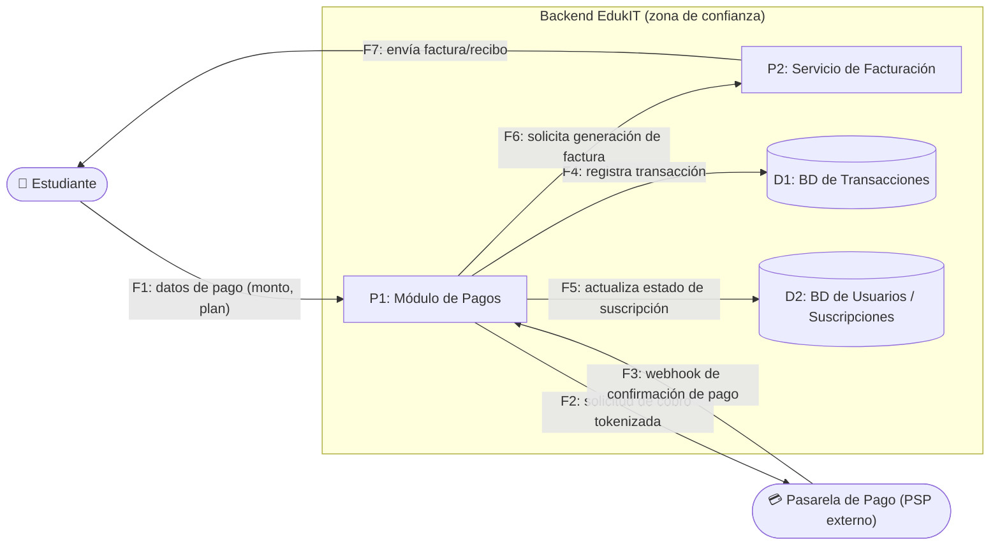

# 🗒️ Registro de Trabajo en Clase - Taller 5: Evaluación de Seguridad con STRIDE

## 📆 Fecha de la sesión
Sabado 05 de septiembre de 2026

## 👥 Integrantes presentes
- Juan David Orozco Rodríguez
- Nicolas Esteban Muñoz Sendoya

## 🧠 Actividades realizadas en clase

- Se revisó la [guía paso a paso de STRIDE](guia_paso_a_paso_stride.md) y el ejemplo guiado sobre el flujo de **acceso de estudiantes a cursos y materiales**, ya resuelto en la guía.
- Como ese flujo ya está cubierto por el ejemplo de la guía, el equipo eligió analizar un flujo distinto de EdukIT: **procesamiento de pagos con terceros (pasarela de pago)**, uno de los "elementos sensibles" listados en el `README.md` del taller.
- Se siguió la metodología de 5 pasos: dibujar el DFD del flujo elegido, identificar sus elementos, aplicar las 6 categorías STRIDE, evaluar impacto/mitigación y priorizar por riesgo.
- Se completó la tabla en `tabla-stride-clase.xlsx` (hoja `Plantilla_STRIDE`), con las 12 columnas de la plantilla oficial (incluye Escenario de Ataque y Controles de Seguridad Existentes).
- Se relacionó uno de los hallazgos (T2 — Tampering sobre el monto de pago) con la técnica del **Reto 2 de OWASP Juice Shop** (manipulación de precio), descrita en la guía.
- Herramientas usadas: Mermaid (para el DFD, se renderiza directo en GitHub) y Excel/`openpyxl` para la tabla STRIDE.

## 🧩 Boceto inicial del modelo — DFD del flujo elegido

**Flujo analizado:** Procesamiento de pagos con terceros (suscripción de un estudiante a EdukIT a través de una pasarela de pago externa).

**Límite de confianza:** el Estudiante y la Pasarela de Pago están fuera del control de EdukIT (la pasarela es, además, un tercero con su propio límite de confianza independiente). El Módulo de Pagos, el Servicio de Facturación y las bases de datos están dentro del backend de EdukIT.

### Elementos identificados (Paso 2)

| ID | Elemento | Tipo |
|---|---|---|
| E1 | Estudiante | Actor externo |
| E2 | Pasarela de Pago (PSP) | Actor externo / tercero |
| P1 | Módulo de Pagos | Proceso |
| P2 | Servicio de Facturación | Proceso |
| D1 | BD de Transacciones | Almacén de datos |
| D2 | BD de Usuarios / Suscripciones | Almacén de datos |
| F1–F7 | Flujos de datos entre los anteriores | Flujo |

### Tabla STRIDE (Pasos 3–4)

La tabla completa con las 12 columnas (ID, Componente/Activo, Tipo STRIDE, Descripción de la Amenaza, Escenario de Ataque, Impacto, Probabilidad, Nivel de Riesgo, Controles de Seguridad Existentes, Mitigación Recomendada, Responsable, Estado) está en [`tabla-stride-clase.xlsx`](tabla-stride-clase.xlsx), hoja `Plantilla_STRIDE`. Se cubrieron las 6 categorías STRIDE (T1–T6), una por cada categoría, sobre el flujo de pagos.

### Priorización por riesgo (Paso 5)

| Prioridad | ID | Tipo STRIDE | Componente / Activo | Nivel de Riesgo |
|---|---|---|---|---|
| 1 | T1 | Spoofing | Módulo de Pagos (P1) / Webhook (F3) | **Alto** |
| 2 | T2 | Tampering | Datos de pago (F1) / Módulo de Pagos (P1) | **Alto** |
| 3 | T6 | Elevation of Privilege | Solicitud de factura (F6) / Servicio de Facturación (P2) | **Alto** |
| 4 | T4 | Information Disclosure | BD de Transacciones (D1) | Medio |
| 5 | T3 | Repudiation | Módulo de Pagos (P1) — registro de transacciones | Medio |
| 6 | T5 | Denial of Service | Módulo de Pagos (P1) | Bajo |

## 🎮 Reto práctico en OWASP Juice Shop (Paso 6 del README)

La guía pide completar al menos uno de los 4 retos de Juice Shop y relacionarlo con una fila de la tabla. Esta parte requiere ejecutar el ataque de verdad contra `http://localhost:3000` (Docker) o la demo pública, algo que el equipo debe correr en su propia máquina durante la sesión — quedó documentado el plan y la fila objetivo, pendiente de ejecutar y registrar evidencia (captura de pantalla) por el equipo:

- **Reto elegido:** #2 — Tampering: comprar un producto pagando menos de su precio real (modificar el campo `price` en la solicitud desde las herramientas de desarrollador del navegador, pestaña Red/Network).
- **Por qué este reto:** es el que mejor mapea con el flujo de pagos de EdukIT — el mismo problema de fondo (el servidor confía en un valor que envía el cliente) aplica directamente a **T2** de la tabla STRIDE (Tampering sobre el monto de pago).
- **Fila de la tabla relacionada:** T2. El campo "Escenario de Ataque" de T2 ya referencia esta técnica.
- **Pendiente para completar en clase/laboratorio:**
  1. Levantar Juice Shop: `docker run --rm -p 3000:3000 bkimminich/juice-shop` y abrir `http://localhost:3000`.
  2. Agregar un producto al carrito, abrir DevTools → pestaña Red, y modificar el valor `price` en la solicitud antes de confirmar la compra.
  3. Confirmar que la compra se procesa con el precio manipulado.
  4. Tomar una captura de pantalla como evidencia y anotar aquí el resultado (qué control faltaba, según la guía: *"el servidor confía en el precio que envía el cliente"*).

## 🔁 Tareas definidas para complementar el taller

| Tarea asignada | Responsable | Fecha estimada |
|----------------|-------------|----------------|
| Ejecutar y documentar el Reto 2 de Juice Shop (evidencia/captura) | Por asignar | Antes de la entrega de Parte 1 |
| Revisar checklist de autoevaluación (sección 7 de la guía) | Juan David Orozco Rodríguez | Antes de la entrega de Parte 1 |

---

_Este documento resume el trabajo colaborativo realizado durante la sesión del Taller 5 (Parte 1) en el curso Arquitectura Empresarial (AREM) - Universidad de La Sabana._
